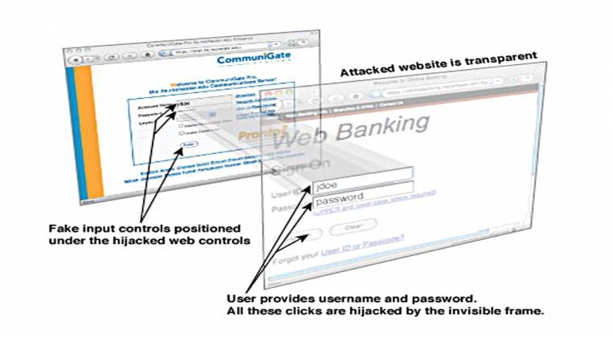
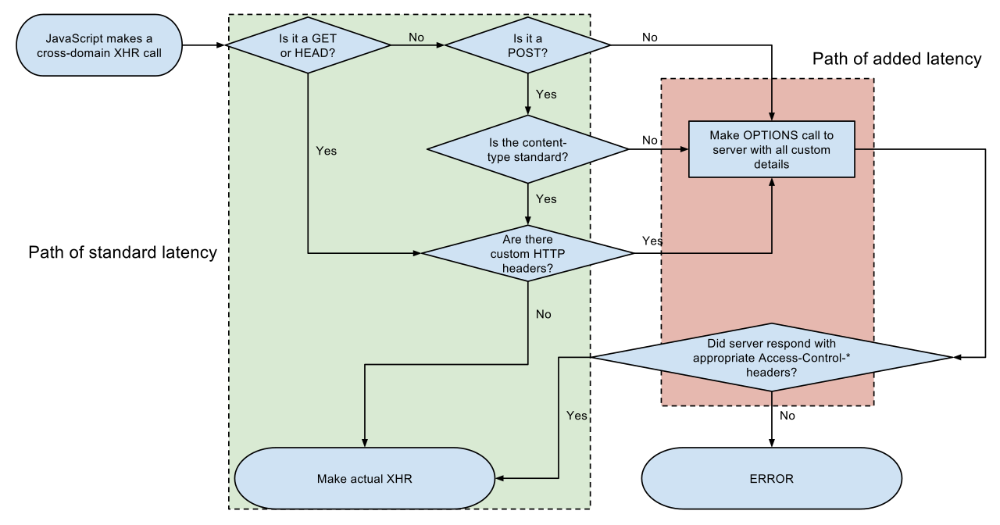

---
author: Andreas Happe
title: HTTP Header Security
--- 

# Agenda

- Allgemeines
- HSTS
- Security-Header
- Cookie-Flags
- SOP & CORS
- CSP

# Allgemeines

## HTTP Header (e.g. generali.at)

~~~ http
HTTP/1.1 200 OK
Date: Sun, 14 Mar 2021 09:20:21 GMT
Server: Apache
Content-Language: de
Strict-Transport-Security: max-age=10886400
Cache-Control: max-age=1
Expires: Sun, 14 Mar 2021 09:20:22 GMT
Vary: Accept-Encoding,User-Agent
Content-Encoding: gzip
X-UA-Compatible: IE=Edge,chrome=1
Keep-Alive: timeout=20, max=86
Connection: Keep-Alive
Transfer-Encoding: chunked
Content-Type: text/html; charset=utf-8
~~~

## Warum Security Header?

Um den Browser Informationen mitzuteilen:

1. Erwartungshaltung für meine Seite
2. Erwartungshaltung bei der Interaktion mit anderen Seiten

HTTP Header sind immer best-effort/hardening

## Site vs. Origin

- Origin: Protokoll + Name + Port
- Site: eTLD+1

~~~
Beispiel: a.site.at
Origin: https://a.site.at:443
Site: site.at
~~~

## Site vs. Origin: Beispiele

Same Site, different Origin:

~~~
a.generali.at
b.generali.at
~~~

## Kompatibilität

- Immer von der Browserversion abhängig
- [caniuse.com](https://caniuse.com/)

# HSTS

## HTTP Strict Transport Security

Folgekommunikation zwischen Browser und Server muss sicher verschlüsselt (HTTPS) erfolgen

## Beispiel

~~~ http
Strict-Transport-Security: max-age=31536000; includeSubDomains
Strict-Transport-Security: max-age=63072000; includeSubDomains; preload
~~~

## Expect-CT

- [Certificate Transparency](https://developer.mozilla.org/de/docs/Web/HTTP/Headers/Expect-CT)
- Schutz vor doppelt vergebenen Zertifikaten
- Obsolete in 2021

~~~ http
Expect-CT: max-age=86400, enforce, report-uri="https://foo.example/report"
~~~

# Security-Header f. Schwachstellen

## Clickjacking / X-Frame-Options

- [Clickjacking / UI-Redress Attacks](https://portswigger.net/web-security/clickjacking)

## X-Frame-Options

~~~ http
X-Frame-Options: deny
X-Frame-Options: sameorigin
X-Frame-Options: allow-from https://example.com/
~~~

## X-Frame-Options: Nachteile

- Header nur einmal erlaubt
- mit allow-from kann nur eine Origin angegeben werden
- Double-Framing ist möglich
- Alternative: CSP

## Content-Sniffing / X-Content-Type-Options

- Schwachstelle bei Verwendung des Internet Explorer

~~~ http
X-Content-Type-Options: nosniff
~~~

## XSS / X-XSS-Protection

- obsolete (Chrome, Firefox, Edge)
- zur Kontrolle des XSS-Schutzes von Browsern gedacht

~~~ http
X-XSS-Protection: 0
X-XSS-Protection: 1
X-XSS-Protection: 1; mode=block
X-XSS-Protection: 1; report=<reporting-uri>
~~~

## Referrer-Policy

- Kontrolliert den Inhalt des Referer-Headers
- Viele veschiedene [Optionen](https://developer.mozilla.org/en-US/docs/Web/HTTP/Headers/Referrer-Policy)
	- full-url vs origin vs. none 
	- same-origin vs. cross-origin
	- http vs. https

## Referrer-Policy: Beispiele

~~~http
Referrer-Policy: no-referrer
Referrer-Policy: no-referrer-when-downgrade
Referrer-Policy: origin
Referrer-Policy: origin-when-cross-origin
Referrer-Policy: same-origin
Referrer-Policy: strict-origin
Referrer-Policy: strict-origin-when-cross-origin
Referrer-Policy: unsafe-url
~~~

- new default: strict-origin-when-cross-origin
- old default: no-referrer-when-downgrade

## Permissions-Policy

- ehemalige Feature-Policy
- noch nicht von Firefox und Safari supported
- Konfiguriert [Browser Features](https://www.w3.org/TR/permissions-policy-1/)

~~~ http
Permissions-Policy: geolocation=(self "https://example.com")
~~~

# Cookie-Flags

## Allgemein

- werden beim Setzen des Cookies angegeben
- Setzen passiert per HTTP-Header

~~~ http
Set-Cookie: <cookie-name>=<cookie-value>
~~~

## Secure-Flag

- Verwendung des Cookies nur via HTTPS

~~~ http
Set-Cookie: <cookie-name>=<cookie-value>; Secure
~~~

## HttpOnly-Flag

- Zugriff mittels JavaScript wird unterbunden
- Achtung falls HTTP TRACE erlaubt ist

~~~ http
Set-Cookie: <cookie-name>=<cookie-value>; HttpOnly
~~~

## sameSite-Flag

- Kontrolle, wann ein Cookie übertragen wird
- Gegenmassnahme zu CSRF-Angriffen

## CSRF-Angriffe

## Möglichkeiten

- strict: nur bei same-site requestes
- lax (default): bei same-site requests, cross-site wenn navigation von externer Seite
- none: same-site und cross-site, secure muss gesetzt werden

~~~ http
Set-Cookie: <cookie-name>=<cookie-value>; SameSite=Strict
~~~

# SOP/CORS

## Same-Origin-Policy

Javascript darf nur auf Resourcen/Operationen zugreifen, wenn der Origin der Resource und der Origin des JavaScripts ident ist.

Grundidee: Isolation zwischen Seiten

## Cross-Origin-Resource Sharing

- Wird durch den Webserver auf den JavaScript zugreifen will gesetzt
- Webserver kann explizit Zugriff von externen Origins erlauben

## CORS: Lese-Zugriff

Bei der Antwort wird ein Header gesetzt

~~~ http
Access-Control-Allow-Origin: http://foo.example
~~~

## CORS: Schreibzugriff

- Bei der Antwort die Erlaubnis mitzuteilen wäre zu spät.
- HTTP OPTIONS vor eigentlichem Zugriff.

## CORS: Zusammenfassung

# Content-Security-Policy (CSP)

## Entstehungsgeschichte

- "logische" Erweiterung aus SOP
- SOP: Schützt die eigene Seite vor fremden Zugriffen
- CSP: Definiert wo in der eigenen Seite JavaScript vorkommen darf

## Basic-Form

~~~ http
Content-Security-Policy: <policy-directive>; <policy-directive>
~~~

Report-Only:

~~~ http
Content-Security-Policy-Report-Only: <policy-directive>; <policy-directive>
~~~

## Verhalten bei mehreren Headern

- nachfolgende Header können zuvorige nur verschärfen

## Direktiven (Auszug)

- script-src, style-src, font-src, media-src, img-src, ..
- frame-src, frame-ancestors
- form-action
- base-uri
- upgrade-insecure-requests, block-all-mixed-content
- report-uri
- default-src

[Genauere Informationen online](https://developer.mozilla.org/en-US/docs/Web/HTTP/Headers/Content-Security-Policy)

## Sources (Werte für Direktiven)

- 'none'
- 'self'
- 'unsafe-inline', 'unsafe-eval', 'strict-dynamic'
- scheme (http:, https:)
- hostname (e.g., https://generali.at)

## Beispiele

~~~
# resourcen nür über https
Content-Security-Policy: default-src https:

# Javascript darf nur in getrennten JS-Files am eigenen Server vorkommen:
Content-Security-Policy: script-src 'self';

# limit fonts und grafiken
Content-Security-Policy: font-src: https://google-fonts.com; img-src 'self' https://img.generali.at;

# limit javascript to script.generali.at
Content-Security-Policy: script-src https://script.generali.at;
~~~

## XSS-Protection

~~~
# limit javascript to scripts from scripts.generali.at
Content-Security-Policy: script-src https://scripts.generali.at;
~~~

Auch wenn der Angreifer im HTML-Code Javascript hinterlegen kann, wird es nicht ausgeführt:

~~~ html
<html>
  <body>
    
	</body>
</html>
~~~

## Verwendung von Javascript

Funktioniert nicht mehr:

~~~ html
<button class='my-javascript-button' onclick="alert('hello');">
~~~

Stattdessen: in eigenem Javascript-File:

~~~html

~~~

~~~ javascript
$(document).ready(function () {
  $('.my-javascript-button').on('click', function() {
	    alert('hello');
	});
});
~~~

## Negative Shortcuts

'unsafe-inline' und 'unsafe-eval' entfernen viel von der Schutzwirkung..

~~~ http
Content-Security-Policy: script-src 'self' 'unsafe-inline' 'unsafe-eval';
~~~

## CSP is hard

[Restricting The Scripts, You're To Blame, You Give CSP a Bad name](https://www.youtube.com/watch?v=jeTGBSL4eQs)

## Reporting 1/2

~~~ http
Content-Security-Policy-Report-Only: default-src 'none'; style-src cdn.example.com; report-uri: /csp-reports
~~~

~~~ html
<!DOCTYPE html>
<html>
	<head>
		<title>Sign Up</title>
		<link rel="stylesheet" href="css/style.css">
	</head>
	<body>
		... Content ...
	</body>
</html>
~~~

## Reporting 2/2

~~~ json
{
  "csp-report": {
	    "document-uri": "http://example.com/signup.html",
			"referrer": "",
			"blocked-uri": "http://example.com/css/style.css",
			"violated-directive": "style-src cdn.example.com",
			"original-policy": "default-src 'none'; style-src cdn.example.com; report-uri /_/csp-reports",
			"disposition": "report"
	}
}
~~~

## Tooling

- Viele Scanner analysieren bereits CSP Direktiven
- [CSPScanner](https://cspscanner.com/)

## [CSP with Google](https://csp.withgoogle.com)

- basieren stark auf nonces

## CSP with Google: Nonces (since 2015)

Nonce: zufälliger nicht-erratenbarer Wert, wird per CSP definiert

~~~ http
Content-Security-Policy: script-src 'nonce-r@nd0m';
~~~

Script-Tags werden ausgeführt, wenn sie den korrekten Nonce verwenden:

~~~ html

~~~

## CSP-with-Google

~~~ http
Content-Security-Policy: default-src https:; script-src 'nonce-{random}'; object-src 'none'
~~~

  > This policy will require all resources to be loaded over HTTPS, allow only script elements with the correct nonce attribute, and prevent loading any plugins.

## [CSP-with-Google](https://csp.withgoogle.com/docs/strict-csp.html#example): strict-CSP

~~~ http
Content-Security-Policy:
  object-src 'none';
	script-src 'nonce-{random}' 'unsafe-inline' 'unsafe-eval' 'strict-dynamic' https: http:;
	base-uri 'none';
	report-uri https://your-report-collector.example.com/
~~~

- unsafe-inline wird von neueren Browsern deaktiviert, falls nonce gesetzt
- strict-dynamic erlaubt das indirekte Laden von javascript, disabled http: und https:
- ganz alte browser fallen also auf http: und https: zurück
- unsafe-eval um Adaption zu erleichtern (sollte entfernt werden)

# Praxisbeispiele

## Online Scanner

- [securityheaders.com](https://securityheaders.com/?q=generali.at&followRedirects=on)
- [Mozilla Observatory](https://observatory.mozilla.org/analyze/generali.at)

# FIN
